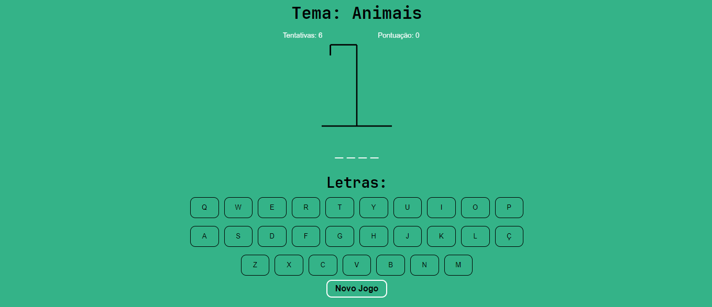

<h1 align="center"> Jogo da Forca </h1>

Joguinho da forca produzido para diversão, teste e se divirta bastante! 

 

  

## 🚀 Tecnologias

Esse projeto foi desenvolvido com as seguintes tecnologias:

- HTML e CSS
- JavaScript
- Git e Github
- Canva

## 💻 Projeto

O Jogo da forca foi desenvolvido nas aulas da AdaTech, com foco em aprender melhor os funcionamentos do CANVA no HTML, e aprimorar as habilidades JavaScript com criatividade

- [Acesse o projeto finalizado, online](https://jogo-da-forca-coral.vercel.app/)

## Créditos

Feito por Dário Klein ♥ 
